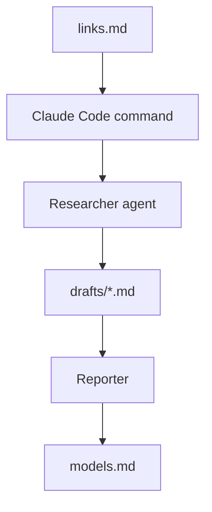
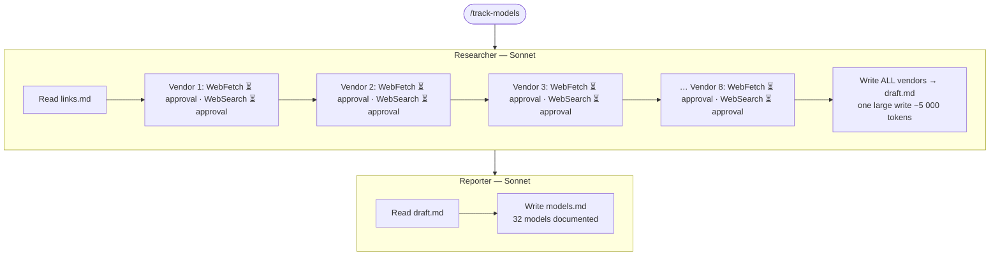
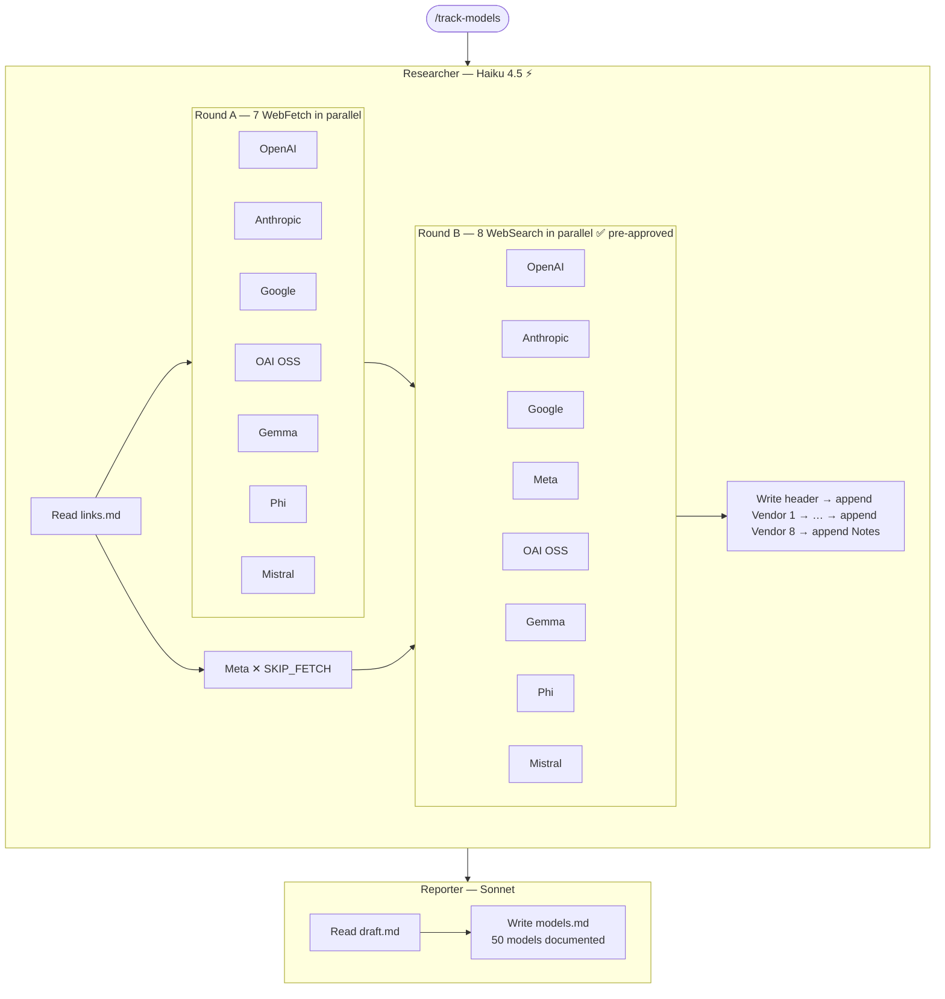

# AI Model Tracking Documentation System

## What This Project Does

This project uses Claude Code to:

1. collect AI model information from official vendor sources
2. generate structured vendor draft files
3. produce a final comparison report

Final output:

```text
models.md
```

The report helps users compare:

- pricing
- context windows
- multimodal support
- deployment options
- recommended use cases

---

# Core Vendors

Supported core vendors:

- OpenAI
- Anthropic
- Google
- Meta
- Microsoft

Additional vendors can also be added dynamically through `links.md`.

---

# Project Structure

```text
.
├── README.md
├── WORKFLOW.md
├── links.md
├── models.md
├── drafts/
└── .claude/
```

Important folders:

| Folder/File | Purpose |
|---|---|
| `links.md` | Official source list |
| `drafts/` | Intermediate vendor outputs |
| `models.md` | Final generated report |
| `.claude/commands/` | Claude Code commands |
| `.claude/subagents/` | Researcher and Reporter agents |

---

# Quick Start

## 1. Install Claude Code

Install Claude Code from the official instructions:

Windows PowerShell:

```powershell
irm https://claude.ai/install.ps1 | iex
```

Windows CMD:

```cmd
curl -fsSL https://claude.ai/install.cmd -o install.cmd && install.cmd && del install.cmd
```

macOS / Linux / WSL:

```bash
curl -fsSL https://claude.ai/install.sh | bash
```

Check installation:

```bash
claude --version
```

---

## 2. Sign In

Open a terminal and run:

```bash
claude
```

Complete the login process.

---

## 3. Open the Project

Recommended:

```text
VS Code
→ Open Folder
→ Select this project
```

Then open:

```text
Terminal
→ New Terminal
```

Make sure the terminal is inside the project root folder.

---

## 4. Start Claude Code

Run:

```bash
claude
```

Claude Code must be started from the project root so it can detect:

```text
.claude/
links.md
drafts/
```

---

# First Test

Run:

```text
/track-openai
```

Expected result:

```text
drafts/openai.md
```

Then run:

```text
/generate-report
```

Expected result:

```text
models.md
```

Open `models.md` to view the final report.

---

# Common Commands

## Update One Core Vendor

```text
/track-openai
/track-google
/track-meta
```

Then:

```text
/generate-report
```

---

## Add and Update a New Vendor

1. Add a new vendor section to `links.md`

Example:

```text
# Mistral
```

2. Run:

```text
/track-vendor Mistral
```

3. Generate the report:

```text
/generate-report
```

This automatically creates:

```text
drafts/mistral.md
```

and includes it in:

```text
models.md
```

---

## Refresh All Vendors

```text
/track-all
```

Then:

```text
/generate-report
```

---

## Full End-to-End Refresh

```text
/update-report
```

This refreshes all drafts and rebuilds `models.md`.

---

# How the System Works



---

# Source Policy

The project follows an official-source-first policy.

Preferred sources:

- official documentation
- official pricing pages
- official GitHub repositories
- official Hugging Face organisation pages
- official model cards

Avoid unofficial blogs and random comparison websites.

---

# Troubleshooting

## Slash commands do not appear

Make sure:

```text
claude
```

was started from the project root folder.

---

## Draft file was not generated

Check:

- the `drafts/` folder exists
- the vendor exists in `links.md`
- Claude Code has file write permission

---

## models.md was not generated

Run:

```text
/generate-report
```

after at least one draft file exists.

---

# Notes

- This is a documentation-focused project, not a web app.
- Claude Code commands are the main interface.
- `drafts/` are intermediate files.
- `models.md` is the final client-facing output.

---

# Performance Optimisations

The following changes were made to reduce total run time from ~21 minutes to ~8–12 minutes, and to increase model coverage from **32 models** to **50 models**.

## Before



## After



## 1. Parallel fetch and search (Researcher)

The Researcher now processes all vendors simultaneously instead of one by one:

- **Round A** — all 7 `WebFetch` calls are issued in a single parallel batch
- **Round B** — all 8 `WebSearch` calls are issued in a single parallel batch after Round A completes

Previously each vendor was fetched and searched sequentially, so total time scaled linearly with the number of vendors.

## 2. Meta URL skip (`links.md`)

Meta's documentation URL (`llama.com/docs/...`) is a client-side React page that returns no usable static content. It is now marked `[SKIP_FETCH]` in `links.md`, so the Researcher skips the fetch entirely and goes directly to web search for that vendor.

## 3. MCP tool permissions (`.claude/settings.local.json`)

The tools `zai-mcp-server` and `zread` (used internally by the Researcher) are now pre-approved in `settings.local.json`. This eliminates the manual approval prompts that blocked execution between tool calls.

## 4. Incremental `draft.md` writing (Researcher)

The Researcher now writes `draft.md` in stages:

1. File header written first, before any vendor is processed
2. Each vendor's section is appended immediately after that vendor's data is extracted
3. Research Notes are appended last

Previously all 8 vendors were formatted and written in a single operation at the end, requiring the model to generate ~5 000 tokens in one shot. Incremental writing reduces each write to ~500–800 tokens.

## 5. Researcher model (`Researcher.md`)

The Researcher subagent now runs on `claude-haiku-4-5-20251001` instead of the default Sonnet. The Researcher's task (structured data extraction and formatted writing) does not require deep reasoning, so Haiku is sufficient and generates tokens approximately 3–4× faster.

The Reporter subagent remains on Sonnet, as it performs compliance validation, cross-vendor analysis, and structured report generation where quality matters more than speed.
