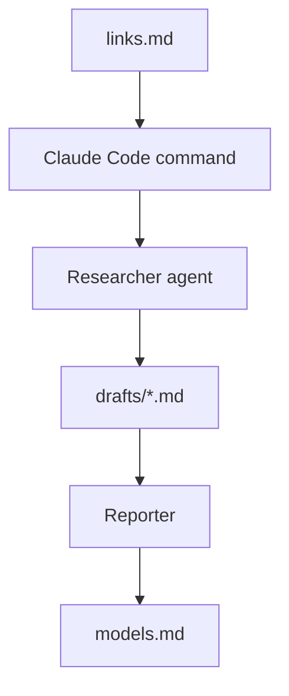
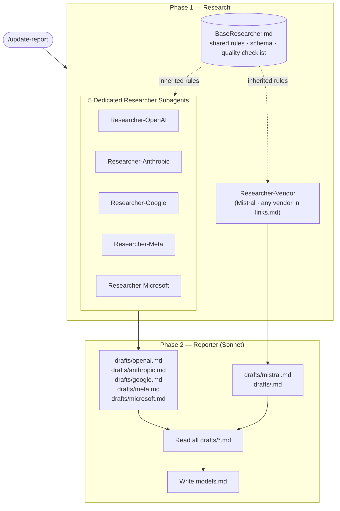

# AI Model Tracking Documentation System

## What This Project Does

This project uses Claude Code to:

1. collect AI model information from official vendor sources
2. generate structured vendor draft files
3. produce a final comparison and recommendation report

Final output:

```text
models.md
```

The report helps users compare:

- pricing
- context windows
- multimodal support
- deployment options
- recommended use cases

---

# Core Vendors

Supported core vendors:

- OpenAI
- Anthropic
- Google
- Meta
- Microsoft

Additional vendors can also be added dynamically through `links.md`.

---

# Project Structure

```text
.
├── README.md
├── WORKFLOW.md
├── links.md
├── models.md
├── drafts/
└── .claude/
```

Important folders:

| Folder/File | Purpose |
|---|---|
| `links.md` | Official source list |
| `drafts/` | Intermediate vendor outputs |
| `models.md` | Final generated report |
| `.claude/commands/` | Claude Code commands |
| `.claude/subagents/` | Researcher and Reporter agents |

---

# Quick Start

## 1. Install Claude Code

Install Claude Code from the official instructions:

Windows PowerShell:

```powershell
irm https://claude.ai/install.ps1 | iex
```

Windows CMD:

```cmd
curl -fsSL https://claude.ai/install.cmd -o install.cmd && install.cmd && del install.cmd
```

macOS / Linux / WSL:

```bash
curl -fsSL https://claude.ai/install.sh | bash
```

Check installation:

```bash
claude --version
```

---

## 2. Sign In

Open a terminal and run:

```bash
claude
```

Complete the login process.

---

## 3. Open the Project

Recommended:

```text
VS Code
→ Open Folder
→ Select this project
```

Then open:

```text
Terminal
→ New Terminal
```

Make sure the terminal is inside the project root folder.

---

## 4. Start Claude Code

Run:

```bash
claude
```

Claude Code must be started from the project root so it can detect:

```text
.claude/
links.md
drafts/
```

---

# First Test

Run:

```text
/track-openai
```

Expected result:

```text
drafts/openai.md
```

Then run:

```text
/generate-report
```

Expected result:

```text
models.md
```

Open `models.md` to view the final report.

---

# Common Commands

## Update One Core Vendor

```text
/track-openai
/track-google
/track-meta
```

Then:

```text
/generate-report
```

---

## Add and Update a New Vendor

1. Add a new vendor section to `links.md`

Example:

```text
# Mistral
```

2. Run:

```text
/track-vendor Mistral
```

3. Generate the report:

```text
/generate-report
```

This automatically creates:

```text
drafts/mistral.md
```

and includes it in:

```text
models.md
```

---

## Refresh All Vendors

```text
/track-all
```

Then:

```text
/generate-report
```

---

## Full End-to-End Refresh

```text
/update-report
```

This refreshes all drafts and rebuilds `models.md`.

---

# How the System Works



---

# Source Policy

The project follows an official-source-first policy.

Preferred sources:

- official documentation
- official pricing pages
- official GitHub repositories
- official Hugging Face organisation pages
- official model cards

Avoid unofficial blogs and random comparison websites.

---

# Troubleshooting

## Slash commands do not appear

Make sure:

```text
claude
```

was started from the project root folder.

---

## Draft file was not generated

Check:

- the `drafts/` folder exists
- the vendor exists in `links.md`
- Claude Code has file write permission

---

## models.md was not generated

Run:

```text
/generate-report
```

after at least one draft file exists.

---

# Notes

- This is a documentation-focused project, not a web app.
- Claude Code commands are the main interface.
- `drafts/` are intermediate files.
- `models.md` is the final client-facing output.

---

# Performance Optimisations

The following changes were made to reduce total run time from ~21 minutes to ~8–12 minutes, and to increase model coverage from **32 models** to **50 models**.

## Before


## After (Current Architecture)



## What changed

**Before**, a single Researcher agent processed all vendors sequentially in one run. Every vendor required a manual approval pause for both `WebFetch` and `WebSearch`, and all collected data was held in memory until a single large write to one shared `draft.md` at the end. Adding or updating one vendor meant re-running the entire pipeline.

**After**, each vendor has its own dedicated Researcher subagent (`Researcher-OpenAI`, `Researcher-Anthropic`, `Researcher-Google`, `Researcher-Meta`, `Researcher-Microsoft`). Additional vendors defined in `links.md` are handled by the generic `Researcher-Vendor`. All Researcher subagents inherit the shared research workflow, required field schema, source policy, and quality checklist from `BaseResearcher.md` — there is no duplicated logic. Each Researcher writes only its own isolated `drafts/<vendor>.md`, so a single vendor can be refreshed independently with commands like `/track-openai` without touching any other vendor's data. The Reporter then reads all files in `drafts/` and synthesises the final `models.md`.

The command entry point also changed: `/track-models` is replaced by a flexible set of commands — `/track-<vendor>` for targeted updates, `/track-all` to refresh all drafts, and `/update-report` for a full end-to-end pipeline run.

## The Team (T01 | S04)
- **Ye Tian:** Create commands and subagents, build workflows and architectures of subsystem.
- **Bo Su:** Optimize prompts and architectures, test workflows of the system.
